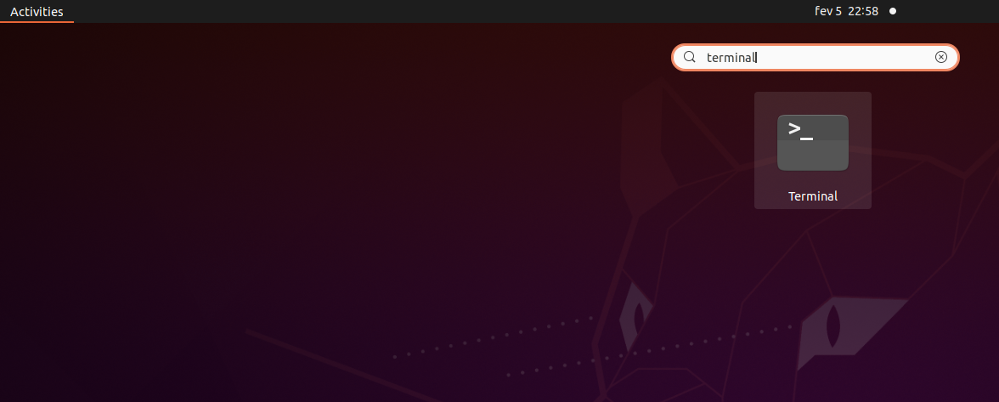
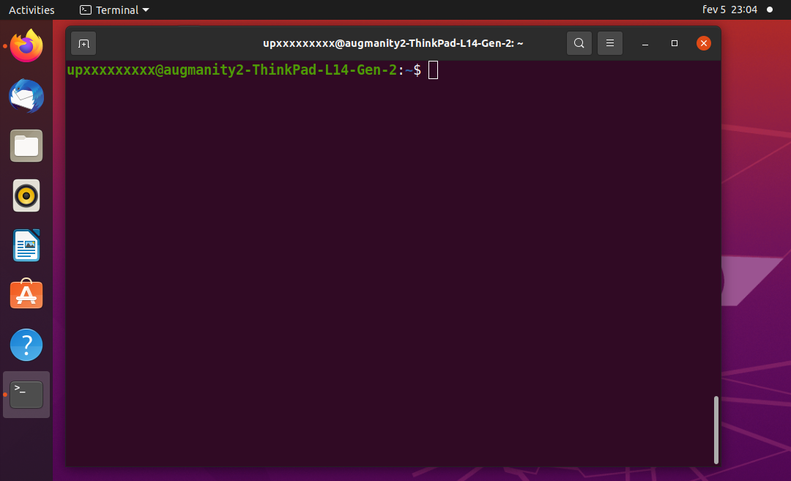

# [Programação (LEIC.009)](https://moodle.up.pt/course/view.php?id=4813) @ [LEIC](https://paginas.fe.up.pt/~estudar/cursos/licenciatura-engenharia-informatica/)

## Introduction

This repository contains an introduction to the programming environment used in this course, which includes:

 - [Using Linux](#using-linux)
 - [Using the terminal](#using-the-terminal)
 - [Installing GCC and Make](#installing-gcc-and-make)
 - [Setting up a development environment for your PC](#setting-up-a-development-environment-for-your-pc)
 - [Compile and run "Hello world!" in C++](#compile-and-run-hello-world-in-c)


## Using Linux

1. Make sure the lab PC boots **Linux** (shut down and restart if Windows is running).
2. Authenticate using your login and password.

## Using the terminal

### What is the command-line terminal?

A terminal lets you introduce commands that are interpreted by what is called a **command-line shell**. In this course, we will make use of it to execute programs installed in the PC.

**Outside the scope of the course**: more advanced shell commands can be used for relatively complex programming. In fact, the shell has a built-in programming language. If you wish to know more, have a look at the [Bash manual](https://www.gnu.org/software/bash/manual/bash.html) for instance.

### Launch the Terminal application

Click on **Activities** (upper-left desktop corner) then enter **Terminal** in the search bar. The **Terminal** application icon should appear. Click on it to launch a terminal.





### Try a few basic commands

The sequence of commands shown below can be used to create a `prog` (sub-)directory (also known as "folder") inside `Desktop`. Note that `Desktop` is itself a sub-directory of your _home_ directory in the file system.

In a Linux terminal, usually the _home directory_ is represented as a `~`, so if you see a path that starts with `~`, this means the path starts at the _home directory_.

Other commands shown below also illustrate common file manipulations (copying, removing, etc).

In the listing, note that `$` is the symbol indicating the command prompt (it could be slightly different in your PC), and sequences starting with `#` are comments.

```bash
$ # Get current working directory
$ pwd
/home/upXXXXXXXXX
$ # List contents of current directory
$ ls
[... other files/directories may appear here ...]
Desktop
[...]
$ # Change working directory to Desktop
$ cd Desktop
$ pwd
/home/upXXXXXXXXX/Desktop
$ # Create sub-directory prog inside current working directory
$ mkdir prog
$ cd prog
$ pwd
/home/upXXXXXXXXX/Desktop/prog
$ # Create a text file named test.txt with a line
$ # containing "We will learn C++"
$ echo We will learn C++ > test.txt
$ # Check that it has been created
$ ls
test.txt
$ # See the contents of test.txt
$ cat test.txt
We will learn C++
$ # Make a copy
$ cp test.txt test2.txt
$ ls
test.txt    test2.txt
$ cat test2.txt
We will learn C++
$ # Remove test2.txt
$ rm test2.txt
$ ls
test.txt
$ # Rename test.txt to test3.txt
$ mv test.txt test3.txt
$ ls
test3.txt
$ # Now remove test3.txt making directory empty
$ rm test3.txt
$ ls
$ # Go back to Desktop directory
$ cd ..
$ pwd
/home/upXXXXXXXXX/Desktop
$ # Go back to home directory
$ cd ..
$ pwd
/home/upXXXXXXXXX
```

**Command summary**

| Command | Use for ...                                                       |
| ------- | ----------------------------------------------------------------- |
| `cat`   | showing the contents of files                                     |
| `cd`    | changing the current working directory.                           |
| `cp`    | copying files                                                     |
| `echo`  | echoing text (example above redirects output to a file using `>`) |
| `ls`    | listing the contents of a directory                               |
| `mkdir` | creating a directory                                              |
| `mv`    | renaming / moving files                                           |
| `pwd`   | printing the current working directory                            |
| `rm`    | removing files                                                    |

For reference and further examples of these and other commands, you may check a number of references online, for instance:

- [SS64.com - An A-Z Index of the Linux command line: bash + utilities](https://ss64.com/bash/)
- [LinuxHandbook.com - A to Z Linux Commands](https://linuxhandbook.com/a-to-z-linux-commands/)

If you want to learn more about the command line, there is a tutorial available from Ubuntu: [The Linux command line for beginners](https://ubuntu.com/tutorials/command-line-for-beginners#1-overview).

## Installing GCC and Make

This section is relevant if you want to set up a development environment on your own PC. If you are using FEUP's lab PCs, GCC and Make are already installed. __If you are in the lab, you can jump to the section [Compile and run "Hello world!" in C++](#compile-and-run-hello-world-in-c) below__.

You will need:

1. Linux or Linux-compatible environment.
2. Required installation: [GCC](https://gcc.gnu.org) (C/C++ compiler) and [Make](https://www.gnu.org/software/make/) (build tool).
3. Optional (but recommended): [GDB](https://www.sourceware.org/gdb/) (C/C++ debugger).
4. [Visual Studio Code](https://code.visualstudio.com/) or a simple text editor of your choice. 

__All these tools are installed in FEUP's labs running Linux.__


## Setting up a development environment for your PC

### Linux

#### Installing Linux

There are several Linux distributions, e.g., [Ubuntu](https://ubuntu.com/tutorials/install-ubuntu-desktop#1-overview) as in FEUP's labs.

#### Package installation

Package [`build-essential`](https://packages.ubuntu.com/focal/build-essential) contains GCC and Make. On Ubuntu for instance, this package can be installed as follows:

```
sudo apt install build-essential 
```

To install GDB as well, execute:

```
sudo apt install gdb
```


### Windows

#### Windows Subsystem for Linux (WSL) - RECOMMENDED 

Use the [Windows Subsystem for Linux (WSL)](https://docs.microsoft.com/en-us/windows/wsl/about).

WSL will provide you with a _"GNU/Linux environment -- including most command-line tools, utilities, and applications -- directly on Windows, unmodified, without the overhead of a traditional virtual machine or dualboot setup"_.

If you configure WSL to run Ubuntu, then you may install GCC and GDB as illustrated previously for (standalone) Linux;
simply run the following commands in the WSL command line:

```
sudo apt install build-essential 
sudo apt install gdb
```

#### Alternative - Linux VM image 

Use [Virtual Box](https://www.virtualbox.org/) for running a Linux VM,
e.g., check this [guide for Ubuntu](https://ubuntu.com/tutorials/how-to-run-ubuntu-desktop-on-a-virtual-machine-using-virtualbox#1-overview).

#### NOT RECOMMENDED!

[Mingw](https://www.mingw-w64.org/) or [Cygwin](http://cygwin.com/) are NOT recommended. The GCC compiler bundled with these environments may not 
contain all the required features. 


### MacOS

### GCC and GDB using Homebrew - RECOMMENDED

Install GCC and GDB using the [Homebrew package manager](https://brew.sh/).

- [GCC](https://formulae.brew.sh/formula/gcc#default)
- [GDB](https://formulae.brew.sh/formula/gdb#default) - you also need to follow the [complementary steps for code-signing GDB](https://sourceware.org/gdb/wiki/PermissionsDarwin)


#### Alternative - use clang

[XCode](https://developer.apple.com/xcode/) includes the [clang C/C++ compiler](https://clang.llvm.org/) that has the same command-line switches as gcc. The [LLDB debugger](https://lldb.llvm.org/) is also an alternative to GDB. 

Some necessary features may be missing from XCode's version of clang, however. 
The [LLVM clang version configured through Homebrew](https://formulae.brew.sh/formula/llvm#default) should work better.

#### Alternative - Linux VM image

Check the instructions given for Windows and VirtualBox above.

### Visual Studio Code setup

__Note__: Visual Studio Code does not include GCC, GDB or Make. Install those tools first as described above.

Steps:

- Install Visual Studio Code on [Linux](https://code.visualstudio.com/docs/setup/linux), [MacOS](https://code.visualstudio.com/docs/setup/mac), or [Windows](https://code.visualstudio.com/docs/setup/windows)
- [Install the C/C++ extension for Visual Studio Code](https://code.visualstudio.com/docs/languages/cpp)
- For Windows + WSL, see this tutorial: [Using C++ and WSL in VS Code](https://code.visualstudio.com/docs/cpp/config-wsl)

You can then use Visual Studio Code as a C++ editor and use the built-in terminal for compiling programs using `make`, then run or debug the programs, etc.

### Online IDE

You can use [Replit](https://replit.com) as a (temporary) work-around.


## Compile and run "Hello world!" in C++

### Get the necessary files

Download the file [`hello.cpp`](hello.cpp), which is the C++ source code of the "Hello world!" program

Usually the file will be downloaded automatically to the `Downloads` directory.
You can copy or move it to the `prog` directory you created in previously (**step 2**) using `cp`.

```bash
$ # "cd" with no arguments: working directory set to home directory
$ cd
$ pwd
/home/upXXXXXXX
$ cp Downloads/hello.cpp Desktop/prog
$ ls Desktop/prog
hello.cpp
```

### The source code

The `hello.cpp` file contains the C++ source code of a program that prints "Hello world!":

```cpp
/*
 A program that prints "Hello world!".
*/
#include <iostream>

int main() {

  // Print the message
  std::cout << "Hello world!\n";

  return 0;
}
```

This example gives you a first impression of C++ syntax:

- **Comments** may be multi-line, beginning with `/*` and ending with `*/`, as in

  ```cpp
  /*
  A program that prints "Hello world!".
  */
  ```

  or single-line, beggining with `//`, as in

  ```cpp
  // Print the message
  ```

- Code indentation (using spaces, line breaks, tabs) **has no semantic meaning**, as in Python. Programs should be well indented for readability, though!

- The `#include` directive

  ```cpp
  #include <iostream>
  ```

  is required to import some C++ definitions related
  to I/O, and is roughly similar to a Python `import` statement. Definitions in the `<iostream>` include are in the `std` namespace, we will need to refer to it when using those definitions.
  Later in the course we will cover these directives in more detail.

- `main` is the program entry **function** with a body of instructions between `{` and `}`. Individual instructions are terminated with a semi-colon (`;`), as in

  ```cpp
  std::cout << "Hello world!\n";
  return 0;
  ```

- The "Hello world!" message is printed by

  ```cpp
  std::cout << "Hello world!\n";
  ```

  where `std::cout` identifies the standard output stream
  of the program, and `"Hello world!\n"` is the string to print.

  `<<` is the left-shift operator, but in this context represents the stream insertion operator (the same way `+` in Python can mean to add or concatenate, depending on the types of the operands),

  Notice that since the definition `cout` is in the namespace `std`, to refer to it we need to use `std::cout`.

- As you may note, `main` returns `0`. This is just a standard convention: `0` tells the operating system that the program executed successfully without errors. When there are errors, a program should return a value different than `0` (e.g., `-1`).


### Compile the program using GCC

**To run the "Hello world!" program you need to compile it first**, that is, to generate an executable file containing binary machine instructions from the source code. This can be done using the GCC C++ compiler, that is, the `g++` program:

```bash
$ cd Desktop/prog
$ cat hello.cpp      # will show the contents above
[...]
$ # Compile the program
$ g++ hello.cpp -o hello
$ ls
hello hello.cpp
```

The execution above of `g++ hello.cpp -o hello` compiles the C++ source code in `hello.cpp` to an executable file called `hello` (with no extension). We can now run the executable file ...

```bash
$ ./hello
Hello world!
```

Note: Compiling C++ code can be complex and on some setups, compiling by hand with this simple command might not work. For instance, if you are on Windows and using the MSYS version of the Clang compiler, you might need to add the flag `-lstdc++` to be able to compile. In the next section we will present a more robust way of compiling C++ code.


### Compile the program using a `Makefile` (Recommended)

Makefiles are files that contain instructions for the `make` build tool. They are used to automate the compilation of programs, and they can be configured to work in a variety of environments. In this section, we will use a `Makefile` that we will provide, which is configured to work in FEUP's labs and in a variety of setups.

First, download the [Makefile](Makefile) and copy it to your `prog` folder.

To compile the program `hello` with source code `hello.cpp` using the `Makefile` it then suffices to execute `make hello`:

```
$ make hello
g++ -std=c++17 -pedantic -Wall -Wuninitialized -Werror -g  -lm -fsanitize=address -fsanitize=undefined     hello.cpp   -o hello
  ```

__Note:__ If you get the following message:

```
make: `hello' is up to date.
```

This means that the `Makefile` thinks that the executable file `hello` is already up to date with respect to the source code `hello.cpp`, so it does not need to be recompiled. This happens because in the previous step you compiled it using GCC. To force recompilation, you can execute `make hello -B` (or `make hello --always-make`), which will ignore the timestamps and recompile anyway.

To compile a program (`PROG`) with several sources (`CPP_FILES`) and headers (`HEADERS`) execute `make PROG=... CPP_FILES="..." HEADERS="..."`. For instance, to compile the files `hello_main.cpp`, `say_hello.cpp`, and `include/say_hello.h`:

  ```
$ make PROG=hello_again CPP_FILES="hello_again.cpp say_hello.cpp" HEADERS="include/say_hello.h"
g++ -std=c++17 -pedantic -Wall -Wuninitialized -Werror -g  -lm -I include -fsanitize=address -fsanitize=undefined  hello_again.cpp say_hello.cpp -o hello_again
  ```

### Compiler settings and their meaning

(according to Makefile contents) 

Option |  Meaning
-------|----------
`-std=c++17` `-pedantic` | Set C++ 2017 as the language standard, and enforce it strictly.
`-Wall -Wuninitialized -Werror` | Generate all standard warnings, warnings for uninitialized variables, and treat warnings as compilation errors.
`-g`   | Generate executable with debug symbols, suitable for use with GDB.
`-lm` | Link with math library.
`-I include` | Search for headers in the `include` folder.
`-fsanitize=address -fsanitize=undefined`| Enable the use of [AddressSanitizer](https://github.com/google/sanitizers/wiki/AddressSanitizer) and [Undefined Behavior Sanitizer](https://clang.llvm.org/docs/UndefinedBehaviorSanitizer.html)


### Compiling the program using CMake and CLion

This year we will not use CMake nor CLion. Instead we will use Make and VS Code, which should be simpler tools and easier to jump in. However, if you have some experience with these or you want to learn more about these, you can check the instructions provided last year [here](https://github.com/progleic/prog2425_setup).

**CMake and CLion are also installed in FEUP's labs running Linux.**


